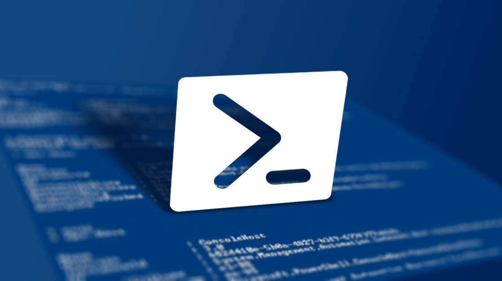
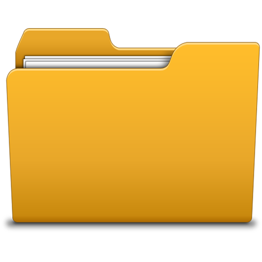

# AWS IAM Automation

<div display:"inline-block">

</div>

The intention behind this tool was to automate the provisioning, maintenance and monitoring of AWS IAM assets across multiple AWS accounts...

- All IAM roles/policies live in source control.
- Enacting change on any role/policy follows Gitflow (branch > PR > merge to master.)
- A build agent triggers on commit to master which runs a tool to publish all assets to the relevant AWS accounts.
- An auditing tool exists in each account which monitors and notifies when any changes to IAM are detected.

## Features

- Uses standard Cloudformation templates for IAM role definitions.
- Uses standard IAM Policy document format for IAM policies.
- Policies when updated leverage the versioning feature of IAM Policies, whereby the current version is always kept when updating a new version. This provides robust rollback on failure.
- Cross-platform, the Powershell scripts/modules have been developed on Powershell Core 6 therefore will run on Windows (native and core), MacOS and Linux.
- Supports an endless number of accounts and roles.
- Supports roles/policies in specific accounts (asymmetrical).
- Provides a way to manage change via source control / Gitflow.
- Provides a way to automate publishing by build agent.

## Operation

- Traverse a folder set which conforms to a convention [see below] and contains one or more accounts.
- For each account folder found, perform the following steps;
  - Validate the folder schema.
  - Read the config file which defines account details and the IAM role used to publish the assets.
  - Switch to the enacting role and account defined in the config using STS assume role.
  - Validate and then upsert the contained role template using AWS Cloudformation CLI (stack update if exists else create stack).
  - Upsert the contained policy document using the AWS IAM CLI (create new policy version if exists else create policy).

## Setup


### PreRequisites

- Powershell
- AWS Command Line Interface (CLI)
- AWS Tools for Powershell

### Windows


- Because **Powershell** is bundled with Windows you can just use the native flavour without any setup required (version 5+ supported). If you wish to use Powershell Core you can install it by following [this guide.](https://docs.microsoft.com/en-us/powershell/scripting/setup/installing-powershell-core-on-windows?view=powershell-6)
- Setup the **AWS CLI** by following [this guide.](https://docs.aws.amazon.com/cli/latest/userguide/installing.html)
- Setup the **AWS Tools for Powershell** by following [this guide.](https://docs.aws.amazon.com/powershell/latest/userguide/pstools-welcome.html)

### MacOS


- Install **Powershell Core** by following [this guide.](https://docs.microsoft.com/en-us/powershell/scripting/setup/installing-powershell-core-on-macos?view=powershell-6)
- Setup the **AWS CLI** by following [this guide.](https://docs.aws.amazon.com/cli/latest/userguide/installing.html)
- Setup the **AWS Tools for Powershell** by following [this guide.](https://docs.aws.amazon.com/powershell/latest/userguide/pstools-welcome.html)

### Linux


- Install **Powershell Core** by following [this guide.](https://docs.microsoft.com/en-us/powershell/scripting/setup/installing-powershell-core-on-linux?view=powershell-6)
- Setup the **AWS CLI** by following [this guide.](https://docs.aws.amazon.com/cli/latest/userguide/installing.html)
- Setup the **AWS Tools for Powershell** by following [this guide.](https://docs.aws.amazon.com/powershell/latest/userguide/pstools-welcome.html)

## Usage



In order for the tool to run (either on a local machine or by a build agent) there must be a valid AWS identity session token present. There are a number of ways to achieve this as [documented here](https://docs.aws.amazon.com/general/latest/gr/aws-security-credentials.html) and [here.](https://docs.aws.amazon.com/cli/latest/userguide/cli-config-files.html)

- Ensure you have a valid AWS credential present.
- Ensure you have a valid root folder to publish.
- Run the Publish-State.ps1 script, passing in the path to the root folder;

```powershell
PS>   ./Publish-State.ps1 -RootFolder /aws-iam-stuff/customer-123/root
```

- It is recommended when becoming familiar with the tool to provide the -Verbose switch in order to see verbose output.
- The script will stop on any errors.
- To see full usage and examples simply run;

```powershell
PS>   Get-Help ./Publish-State.ps1 -full
```

## Folder Schema



A description of each expected file is as follows;

- **global.template** - Cloudformation template to store parameters, conditions or mappings. If provided this is merged into each role.template, saving you having to duplicate these in each role.template file. Format is standard Cloudformation JSON.
- **config.json** - Defines params for each account to reference, format is JSON and schema is detailed below (Config Schema).
- **role.template** - The role definition, format is standard Cloudformation JSON.
- **policy.json** - The policy definition, format is standard IAM policy document JSON.

```text
root/
   |
   |-[account folder]/
   |   |-[role folder]/
   |   |   |-policy.json
   |   |   |-role.template
   |   |-[another role folder]
   |   |   |-policy.json
   |   |   |-role.template
   |   |
   |   |-config.json
   |
   |-[another account folder]/
   |   |-[another role folder]
   |   |   |-policy.json
   |   |   |-role.template
   |   |
   |   |-config.json
   |
   |-global.template
```

The theoretical example that is included in this repo can be shown as...

```text
example-config/
   |
   root/
      |
      |-master/
      |   |-external-admin/
      |   |   |-policy.json
      |   |   |-role.template
      |   |-external-developer/
      |   |   |-policy.json
      |   |   |-role.template
      |   |-external-guest/
      |   |   |-policy.json
      |   |   |-role.template
      |   |-internal-iam-auditing/
      |   |   |-policy.json
      |   |   |-role.template
      |   |
      |   |-config.json
      |
      |-staging/
      |   |-external-admin/
      |   |   |-policy.json
      |   |   |-role.template
      |   |-external-developer/
      |   |   |-policy.json
      |   |   |-role.template
      |   |-external-guest/
      |   |   |-policy.json
      |   |   |-role.template
      |   |-internal-iam-auditing/
      |   |   |-policy.json
      |   |   |-role.template
      |   |
      |   |-config.json
      |
      |-global.template

```

## Config Schema


The config.json file in the root of each account folder must specify the following parameters;

- AccountName - The arbitrary/friendly name for the AWS account, eg "Master"
- AccountNumber - The AWS Account Number, eg "1234567890"
- Region - The default AWS Region to use, eg "ap-southeast-2"
- EnactingRoleArn - The ARN of the IAM role used to publish, eg "arn:aws:iam::1234567890:role/admin-foo-role"

An example of this is as follows...

```json
{
    "AccountName" : "Master",
    "AccountNumber" : "1234567890",
    "Region" : "ap-southeast-2",
    "EnactingRoleArn" : "arn:aws:iam::1234567890:role/admin-foo-role"
}
```

## Troubleshooting


If you see errors when running the tool, first check the following...

- Ensure you have an AWS credentials session token present.
- Ensure the role that your initial credentials are assuming has access to switch to the EnactingRole you specify.
- Ensure that the EnactingRole you specify has the necessary access. An example of the minimum set of perms required for this tool is...

```json
{
  "Version": "2012-10-17",
  "Statement": [
    {
      "Action": [
        "iam:GetRole",
        "iam:GetPolicy",
        "iam:ListRolePolicies",
        "iam:ListPolicyVersions",
        "iam:ListAttachedRolePolicies",
        "iam:CreateRole",
        "iam:CreatePolicy",
        "iam:CreatePolicyVersion",
        "iam:AttachRolePolicy",
        "iam:UpdateAssumeRolePolicy",
        "iam:DeleteRole",
        "iam:DetachRolePolicy",
        "iam:DeletePolicyVersion",
        "cloudformation:DescribeStacks",
        "cloudformation:CreateStack",
        "cloudformation:ValidateTemplate",
        "cloudformation:DescribeChangeSet",
        "cloudformation:CreateChangeSet",
        "cloudformation:ExecuteChangeSet"
      ],
      "Effect": "Allow",
      "Resource": [
        "*"
      ]
    }
  ]
}
```

- At times, your API calls to AWS may be rate limited, causing timeouts. Some example post on this can be [read here.](https://stackoverflow.com/questions/23728591/ec2-api-throttling-limits)
- Also be aware of AWS Service Limits that exist on your account(s). Further reading can be [found here.](https://docs.aws.amazon.com/general/latest/gr/aws_service_limits.html)
